# Report 5
### (3rd Feb 7th Feb 2020)

[Link to Deep Learning Model](https://github.com/GMORsys/analyse_monitor_behavior/tree/feature/shivam/Estimating_probability/Tensorflow_Approach)

[Link to the Jupyter Notebook](https://github.com/GMORsys/analyse_monitor_behavior/blob/feature/shivam/Estimating_probability/Tensorflow_Approach/Jupyter_Notebook/TF_final.ipynb)

(The trained model as tensorflow checkpoint, its respective tensorboard logs and output can be seen in the folder named *Tensorflow_Approach*)

## Abstract:

The problem to predict the probability of answering a survey within 24 hours has been a challenging tasks. From understanding the systems to carefully grasping the terminology, this project has been extremely educative. Not just special skill sets or creative problem solving approach, machine learning demands patience, a lot of patience before it starts to bear desirable results. This report is how I approached the problem and what challenges I faced in this proect.

## Challenges:

### Feature Selection:

This was a big problem and in fact remained an issue to think about until last week when I had to go through each data file and decide which ones of the given features are useful and have direct relationship with the target variable. In feature selection, not only the correlation matters but also the process of collecting those features. So these are the features which I finalised to use in my machine learning model:

  * `age:` The age of the monitor.
  * `last_active_duration:` The time duration between today and the date when a monitor enrolled.
  * `enrollment_duration:` The time duration between today and the date when a monitor answered his last survey.
  * `ratio:` It's a ratio between the number of surveys answered by a monitor to the number of surveys delivered to him.
  * `country:` The country a monitor belongs to.
  * `gender:` The sex of each monitor.
  * `panel_type:` The panel used by a monitor to answer a survey.

There is one thing common in all of these features which was missing in previous feature groups incorporated in training a model: **Each of these feature is unique to a monitor and is independent of other parameters.**

Apart from these determining features, I have used three other features too for identification purposes (which are mentioned in this report whenever they fit in the context). The features are as follows:

   * `jn_monitor_id:` It is a unique identification number given to each monitor for easy and convenient recognition.
   * `research_id:` It is also a unique identification number but instead of monitor, it is given to each research to serve the same purpose.
   * `status_cd:` This code is unique to each research and symbolises the status of the research in terms of whether that particular research was answered or not. **0** means that the research was not answered and **1** means that it was answered.

But the last three features are not used in training because they are not deterministic and holds no concrete significance towards the target variable.

### Imbalanced Data:

Although biased but this was a very realistic problem. Many prominent problems in real life are biased, for example, fraud credit card protection, etc. In this data, we have two values for status code, 0 and 1. And almost 90% of the whole dataset has status code equals to 0. So if I had trained a model on this dataset then it would have learned to recognize each data sample point having a status code equals to 0 which is not desirable because, as I will tell later, both these cases carries unequal penalties. So to have a robust and a generalized mode I had three ways to tackle this problems, which are listed below:

  * **Downsampling:** Downsampling is when you sample out data points from the original dataset keeping the minority class intact but reducing the number of samples from the majority class to achieve equal proportions of each class or some pre-determined ratio. Although it makes the computation faster but at the cost of data, which essentially is the fuel of machine learning. Also, downsampling causes loss of crucial which could help in defining the relation between the features and the target variable.
  
  * **Upsampling:** Upsampling is the counter process of downsampling. It is also a kind of resampling from the original data where the majority class is left intact but samples are drawn from the minority class again and again until either both the classes become equal or they achieve some desired ratio. Upsampling has an advantage that it makes the model to see the minority data more often (as it is duplicated) and thus obliges the model to learn that characteristic. But again, the most fundamental rule of machine learning says that there is no free lunch! Although upsampling increases the occurence of minority class data points, it also makes the model more prone to overfitting. And I am not saying this fact after reading it somewhere but from my own experience. When I upsampled the dataset, my model was overfitting a lot, although I managed to control it by using regularizers and dropout layers but it somewhat limited the learning power of the model.
  
  * **SMOTE:** SMOTE stands for Synthetic Minority Over-Sampling Technique, and as the name suggests it is a variation of upsampling but rather than resampling data points again and again, it creates new data points. This is more beneficial than the other two methods mentioned because rather than duplicate or no data points, it gives new data points which leads to a more general model.
  
 I tried implementing downsampling and upsampling before and their results can be seen in my previous reports. This time I tried to implement SMOTE and the first time I failed because of the limitation of the library. SMOTE from **imblearn** is still under development and still cannot work on continous labels. So I kept trying a couple of times to make it work until it hit me that just while implementing it, I could assume a binary class feature as my label and my target variable as a feature. And I was really happy when it worked. After that I again switched back the columns to their respective places.
 
 Another dilemna, which I faced, while applying SMOTE was whether to apply it over whole dataset or just the training part? After considering the following point(s), I decided to apply it only on the training part and leaving test data totally natural and untouched.
 
 **-** The whole point of training a machine learning is to make it capable of predicting values for real world data, which is natural and unseen. Had I applied SMOTE over all of the data then the test data would have also changed and even the model had given good results for that test data, it would have not be of any use cause it would work terribly on a real life data.
 
 **I tried SMOTE with two variations:**
 
 **1.** *To make the minority class equal to the majority class:* Although this gave me good results but after working on for a long time I realised that this model was not very general and perhaps not fit to work on real life data. I thought so because it was trained on a dataset which had equal number of data points from each class. Although the whole point of applying resampling was to make the model learn to recognize both the class but given the structure of the dataset, it must know that the date it is supposed to work on will not be equally partioned and it must be able to incorporate that fact in its training. Therefore, I decided to go with my second approach.
 
 **2.** *Applying SMOTE in such a way that minorty and majority classes achieve a given ratio:* I chose this ratio in such a way that after applying SMOTE the minority class would be about 30% of the whole dataset. And this gave me better results than approach 1. The final model has this feature incorporated.
 
### Determining the loss function:

This was the biggest problem I faced amongst other major problems I have mentioned and/or will mention. I worked one whole day without any sleep on this until it finally clicked me that a fundamental rule was being broken. Initially I thought that I would use simple MSE as the loss function to track the training of my model. It was then that I asked you about the function used by the company to evaluate a model? I decided to use that method as my loss function because that would have trained the model exactly according to the need. This is the reason why I asked you to work on Tensorflow than Keras because Tensorflow is a lower level framework and it gives much more felxibility over the computation than Keras.

I was planning to design my own custom function to use in the training and kept trying to frame it in tensorflow but after a long time I realised that there was no way to write it because it is non-differentiable. Any deep learning cannot work on a non-differentiable loss function because it hinders the flow of tensors during backpropagation. Even if I had built two computation graphs, it would not have been possible the very fundamental of backpropagation was broken.

In the end I had to drop the idea of using it a loss function and I went with mean squared error loss function and use the company's method as a metric for evaluation.

### Hyperparameter Optimization:

Once I had written the code almost all of the whole week went into tuning the hyperparameters. In the first couple of runs, my model's loss (MSE) was not going below 1.5 per step or 800 per epoch, which was extremely bad. I was also calculating the R2-score to keep track of the training and it was coming about -1200, which was really really bad. So I embarked my journey on hyperparamter optimization:

* **Batch Size:**

I had once read a [research paper](https://arxiv.org/abs/1609.04836) viz. *On Large-Batch Training for Deep Learning: Generalization Gap and Sharp Minima* which says that large batch sizes tends to significantly degrade the quality of a model, as measured by its ability to generalize. Although the real reason and a precise answer is not known yet but there are speculations that this happens because large-batch methods tend to converge to sharp minimizers of the training function. Also, optimizers used in deep learning work in small batch regime.

But still, I tried different batch sizes because in deep learning nothing is completely certain, it significantly depends on the dataset. I found that R2-score was notably effected by the change in batch size. I was initially using a batch size of 1000, because large batch sizes makes computations faster and I needed that because I was trying out different combinations, and R2-score was coming out around -1200 or -900 at best.

But then I changed the batch size to somewhat around 500 and the R2-score increased dramatically, which is not a certain but indicative sign of improvement. So I further lowered the batch size to 300 and R2-score increased again to about -100. After this, nothing much improved by further lowering the batch size so I decided to stick with 300 samples.

* **Number of hidden layers and neurons:**

There is no rule of thumb in deep learning which clearly states how many hidden layers to use but we often use a formula to determine it, or at least get an idea of how many hidden layers are required.

where, 
  * h_i: number of hidden layers.
  * N: number of samples.
  * n_i: number of neurons in input layer.
  * n_o: number of neurons in output layer.
  * alpha: It's a contant between 2-10.
  
So, even if I have used 1000 neurons in first layer then also, it would have taken me minimum 68 layers to follow this rule. I have used this expression before too while working with CNNs and GANs, and it used to work then. Maybe it's not meant for regression or when number of features are low.

There is one more workaround we use to get an idea of how many neurons to use. It says: **The number of trainable variables should be close to the number of samples in the dataset.** I tried this too, but since the dataset is quite big, this led to a very big network which was taking a long time in computation.

I didn't get much idea from these tricks so I had to improvise. I tried different combinations of neurons and hidden layers and training on each combination to determine which one is better than others. I finally decided to go with **5 layers having 100, 50, 20, 10, and 1 neuron(s) respectively.**

Other combinations I tried were:

  * 6 layers with 526, 128, 64, 32, 16, 1 neurons respectively. This led to overfitting.
  * 3 layers with 64, 32, 1 neurons respectively. This network was too simple to learn anything.
  * 6 layers with 1024, 526, 128, 64, 32, 1 neurons respectively. This network took a really long time for computation.
  * 5 layers with 16, 8, 4, 2, 1 neurons respectively. This network didn't learn anything, the loss remained constant.
  
I had to train on each combination to see if the combination was working.

* **Learning Rate and Optimizer:**

Surprisingly changing the learning rate didn't have much effect on the training except slowing down the process and skipping the minima. Learning rate effects the process only when other parameters are right AND if you start at the right place on the curve of the cost function. This is when I realised where I was going wrong all along. I was assuming my cost function to be some higher dimensional convex function.

* **Initializer:**

Since my cost function was mean squared error, I safely and deliberately assumed that my cost function would be some convex function in a higher dimensional space. But since the learning rate didn't have much effect on the training, then I must be starting at a wrong place on the curve to approach the minima. To confirm this speculation, I decided to change the initializers of my trainable variables. 

I had been using ***random_normal_initializer*** so far which was showing some progress initially but then became stagnant. So I changed my initializer to ***zeros*** which made the training even worse, now it didn't even show any progress. But I was really happy, it confirmed my assumption that **the cost function was not convex**. 

Then I used ***ones***, it also had the same effect as *zeros*. With each change in the initializer I was also monitoring the gradients of the variables. So far the gradients were pretty stagnant and were not changing much, which meant that the training was not happening. Things started to take turn towards progress when I used ***variance_scaling_initializer with fan_avg mode***, the gradients became active and the loss started to go down. After two days of fiddeling with hyper-parameters, I finally started to see good results.

I used other initializers too, like, ***lecun_uniform_initializer***, ***he_uniform***, and ***glorot_uniform*** and finally settled with the *glorot_uniform*.

* **Activation Function:**

Right from the start I had been using ***relu*** in all the layers except the last layer, in which I was using ***sigmoid*** because I wanted my output to be between 0 and 1. Then I change the activation in the last layer to ***softmax*** which made the training to get trapped in local minima. 

But then I changed the activation in the second last layer to softlus because I was getting an idea that maybe the values were dying in the second last layer towards the negative side. And when I changed the activation to ***softplus*** in the second last layer, I saw some significant progress.

* **Regularizers:**

I have used three regularizers:
  
  * L1 Regularizer.
  * L2 Regularizer.
  * Dropout after each activation layer.
  
I first used L2 regularizer with scale=0.0001 but increased it when the model started to overfit. But then it stopped the training, so I thought that maybe L1 regularizer with a small scale would be more effective because L1 regularizer is more robust towards overfitting. But L1 regularizer, even with scale=0.0001, stopped the training so I had to finally use them both along with dropout after each activation layer with *dropout_rate=0.5*. 

## Results

### Loss Curves

* **MSE Loss Curve**

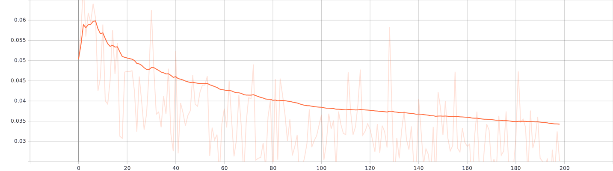

* **Model_Loss (MSE + Regularization)**

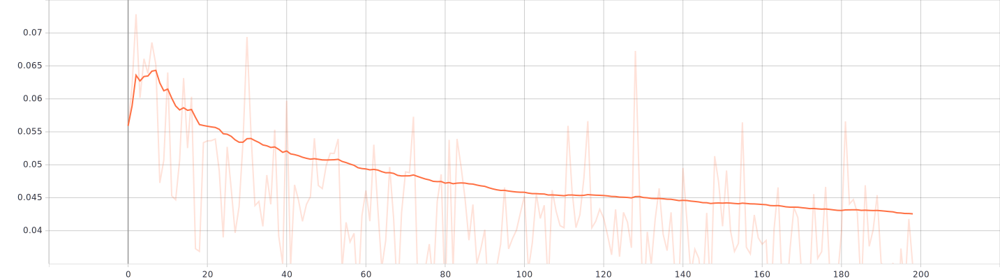

### Gradient Distributions of the Variables

* Gradient Distribution of Weights of Layer 1

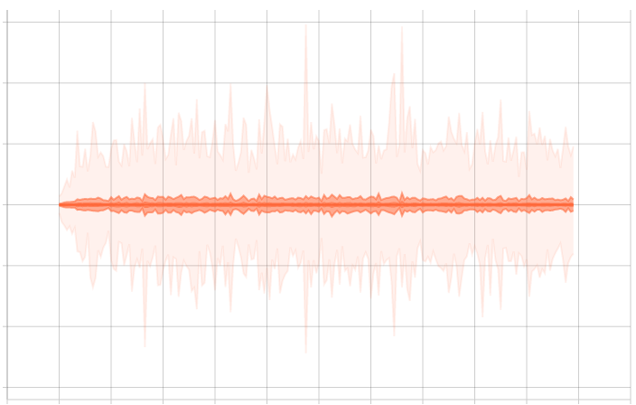

* Gradient Distribution of Bias of Layer 1

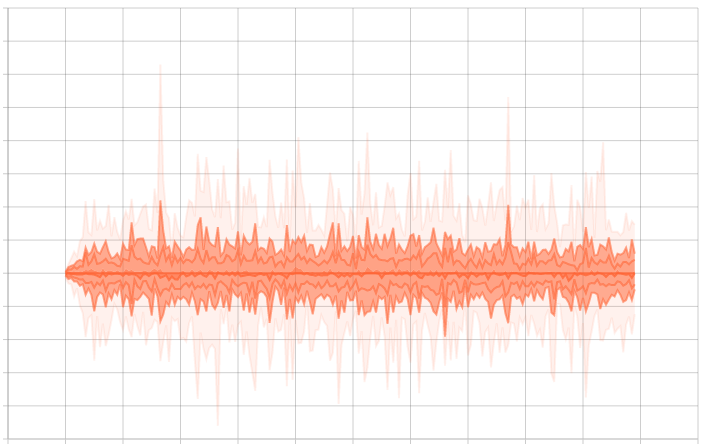

* Gradient Distribution of Weights of Layer 2

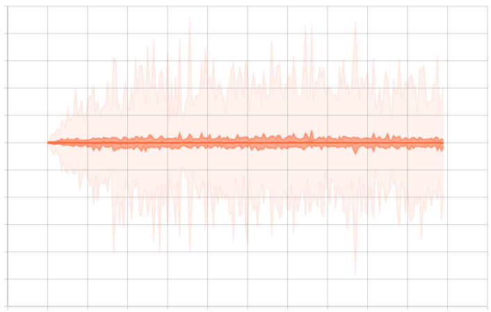

* Gradient Distribution of Bias of Layer 2

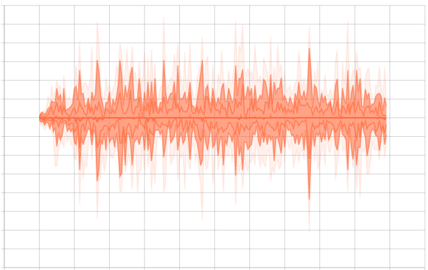

* Gradient Distribution of Weights of Layer 3

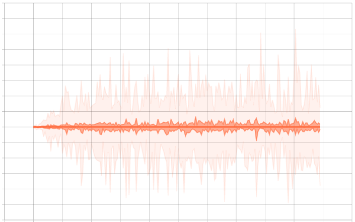

* Gradient Distribution of Bias of Layer 3

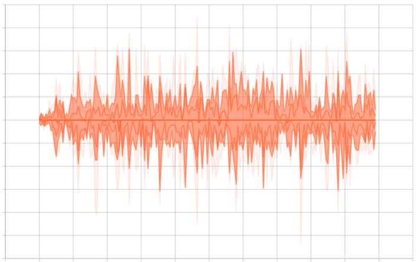

* Gradient Distribution of Weights of Layer 4

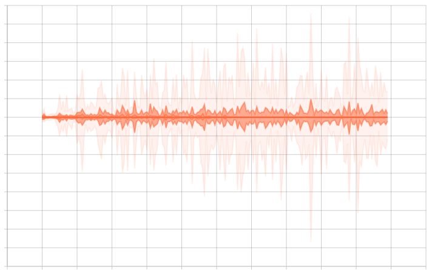

* Gradient Distribution of Bias of Layer 4

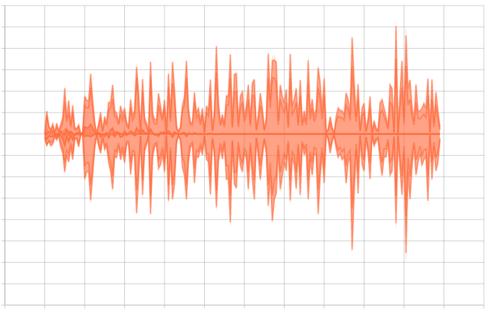

* Gradient Distribution of Weights of Output Layer

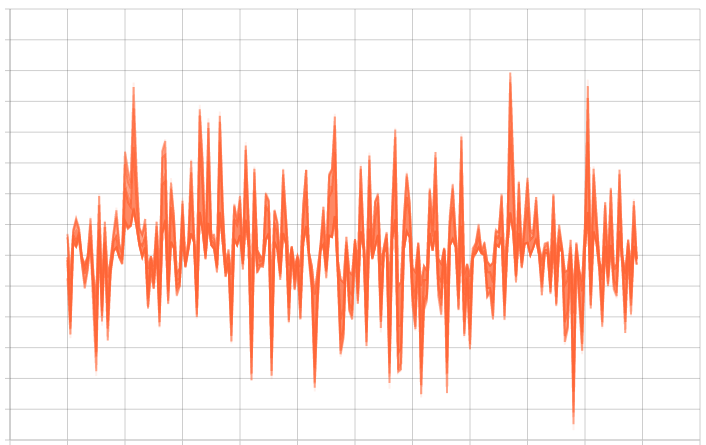

* Gradient Distribution of Bias of Output Layer

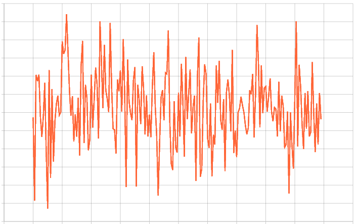

**As can be seen from the distribution of gradients of weights and biases:**

  * Gradients of weights remained almost the same throughout the training and are comparingly smaller than that of the bias. It could mean biases were updated by large steps than the weights.
  * The gradients of bias of layer 2 are larger than that of layer 1 which means that the inner layers are learning more significant information ragarding the data. The gradients of weights are quite small, which means that the weights are not changing by large steps.
  * The gradients of weigths of layer 3 and layer 4 are also small as those of layer 1 and layer 2. This could be because of the initialization or just simply because the weight didn't need to change much to reach the minima. We can get more information about this by seeing the distribution of the weights.
  * The gradients of the biases of the layer 3 and layer 4 are quite big which means that the biases were updated with big steps, which is a good sign, because it shows that the model was indeed learning.
  * The gradients of the output layer are quite large which means that this layer is highly active while learning.
  * There is one important to note about the gradient distributions of the weights of all four layers, although from the distributions it might look like the weights are not changing much. But that only holds for some percentiles of the weights. It can be clearly seen from the images that for each weight, 7% and 93% percentile gradients are highly active. This can be confirmed by seeing the distributions of the weights.
  
### Distribution of the Weights and Biases

* Distribution of Weights of Layer 1

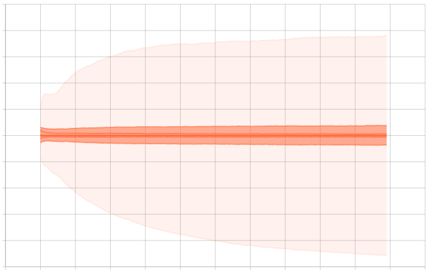

* Distribution of Bias of Layer 1

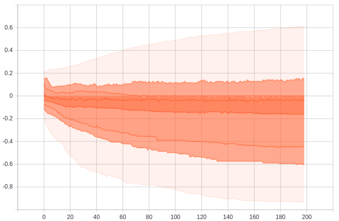

* Distribution of Weights of Layer 2

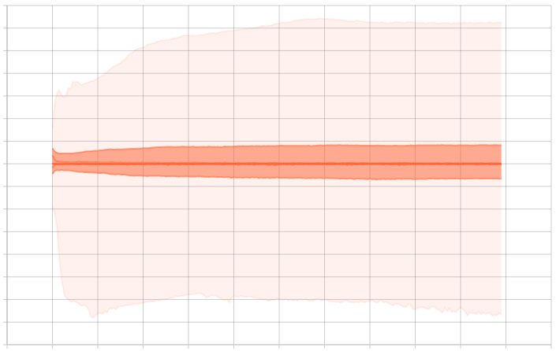

* Distribution of Bias of Layer 2

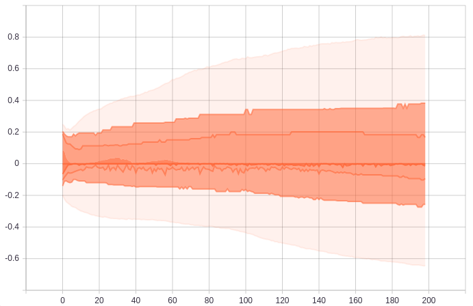

* Distribution of Weights of Layer 3

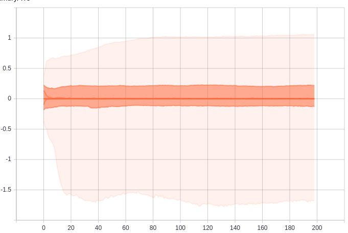

* Distribution of Bias of Layer 3

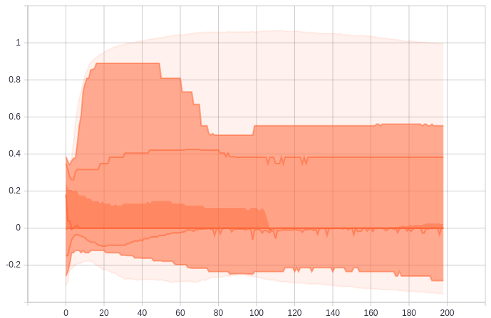

* Distribution of Weights of Layer 4

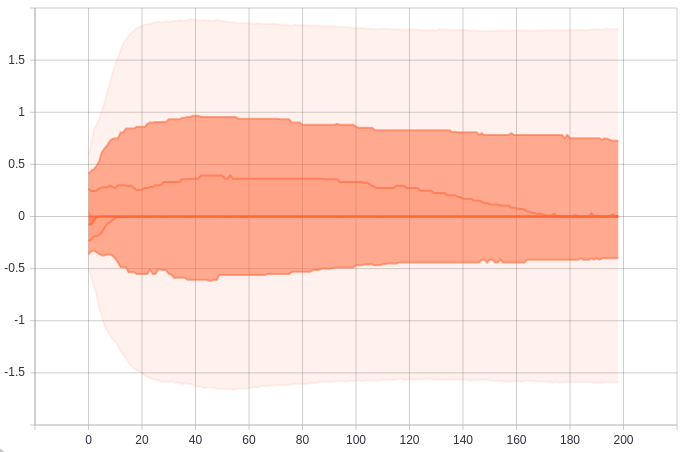

* Distribution of Bias of Layer 4

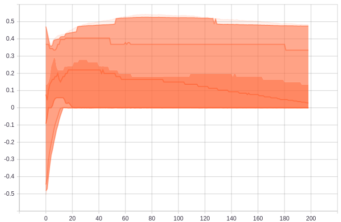

* Distribution of Weights of Output Layer

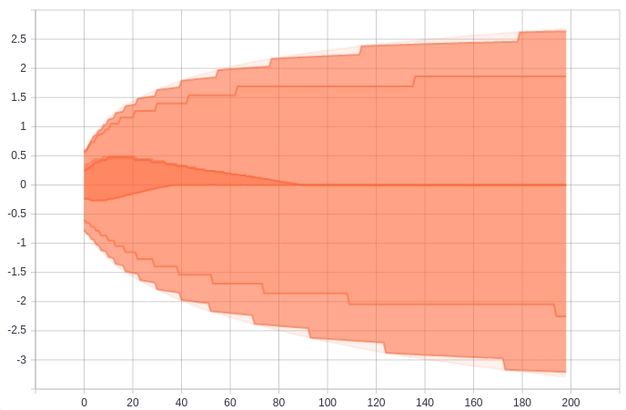

* Distribution of Bias of Output Layer

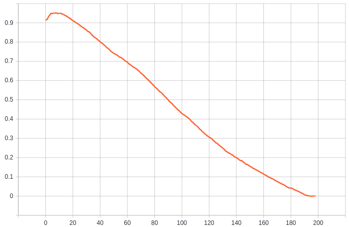

  * For the weights, only their outer percentiles are changing which is compatible with the respective gradient distributions.
  * The bias distributions are very noticeable, which are again compatible with their gradient distribution.
  * And also, this is good sign. It shows that the network was truly learning.
  
### The Computational Graph of the Model

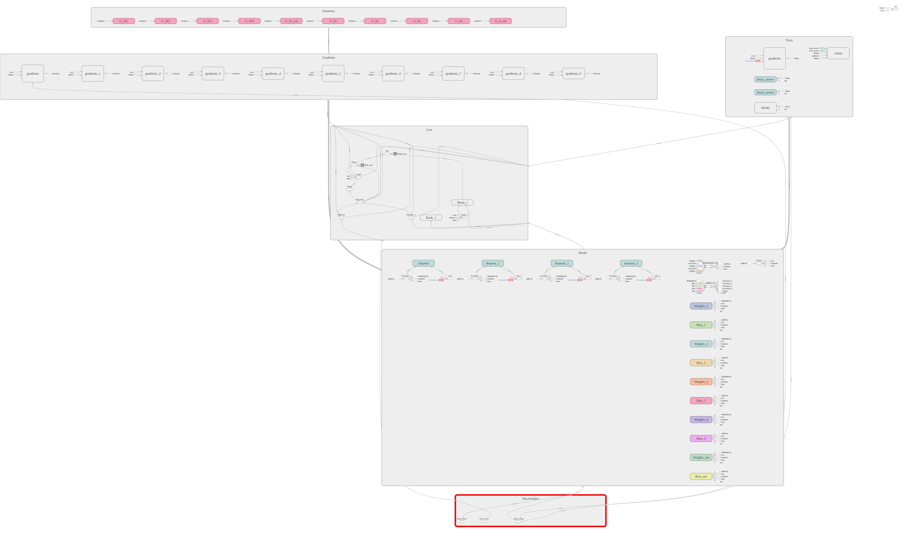

### The Prediction V/s The True Values

The blue dots are the true value and the red points are their corresponding predictions made by the model. It is only for 100 random points from the test data (without SMOTE).

### The histogram of the research and the ratio

### Metrics of the model (On Test Data)

* **MSE_Loss =** 0.083121
* **R2-score =** 0.509891
* **Mean of the ratio histogram =** 1.079377 (or 107.9377 %)
* **Median of the ratio histogram =** 1.019380 (or 101.9380 %)
* **Mode of the ratio histogram =** 1.352050 (or 135.2050 %)